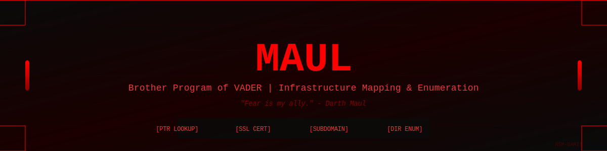

<div align="center">
  

  <br/>

  
</div>

---

### *By a Star Wars Nerd*

> **"Fear. Fear attracts the fearful, the strong, the weak, the innocent, the corrupt. Fear. Fear is my ally."** - Darth Maul

Maul is a comprehensive infrastructure mapping and enumeration tool designed for deep reconnaissance. Built to work alongside **Vader**, Maul takes discovered IPs and domains, maps them back to infrastructure through reverse DNS (PTR records), SSL certificate analysis, and aggressive subdomain/directory enumeration to completely map the entire attack surface.

---

## Features

### Infrastructure Mapping
✅ **IP-to-Domain Mapping** - Reverse DNS (PTR) lookups to map IPs back to domains
✅ **SSL Certificate Analysis** - Extract domains from SSL/TLS certificates
✅ **WHOIS Integration** - Gather ownership and registration data (Coming Soon)
✅ **ASN Mapping** - Map infrastructure to Autonomous System Numbers (Coming Soon)

### Enumeration Capabilities
✅ **Subdomain Enumeration** - Brute force subdomains using built-in wordlists
✅ **Directory Enumeration** - Discover hidden paths and directories (Coming Soon)
✅ **Virtual Host Discovery** - Identify virtual hosts on shared IPs (Coming Soon)

### Performance & Output
✅ **Multi-Target Support** - Process bulk IP lists and domain files from Vader
✅ **High-Speed Threading** - Concurrent scanning with customizable thread counts
✅ **Status Code Filtering** - Filter results by HTTP response codes
✅ **Result Saving** - Export discoveries to timestamped files
✅ **Rich UI** - Live scanning dashboard with real-time stats

---

## Installation

```bash
git clone https://github.com/nsm-barii/maul.git
cd maul/src
python3 -m venv venv
source venv/bin/activate
pip install -r requirements.txt
```

---

## Usage

### Infrastructure Mapping from Vader Output
Map IPs from Vader to domains using PTR records and SSL certificates:
```bash
sudo venv/bin/python main.py -i ips.txt --map-infrastructure
```

### Basic Subdomain Scan
```bash
sudo venv/bin/python main.py -u example.com
```

### Scan Multiple Domains
```bash
sudo venv/bin/python main.py -d domains.txt
```

### Full Workflow (Vader → Maul)
```bash
# 1. Vader discovers IPs
# 2. Pass IP list to Maul for complete infrastructure mapping
sudo venv/bin/python main.py -i vader_ips.txt \
  --map-infrastructure \
  --sub-wordlist large.txt \
  --dir-wordlist medium.txt \
  --save
```

### Advanced Options
```bash
sudo venv/bin/python main.py -u example.com \
  --sub-wordlist large.txt \
  --status-codes 200,301,302 \
  -t 500 \
  --timeout 3 \
  --save
```

---

## Arguments

| Flag | Description |
|------|-------------|
| `-u` | Single domain to scan |
| `-d` | Text file containing list of domains |
| `-i` | Text file containing list of IPs (from Vader output) |
| `-t` | Maximum threads (default: 250) |
| `--map-infrastructure` | Enable PTR lookups and SSL cert extraction for IP-to-domain mapping |
| `--ptr-only` | Only perform reverse DNS (PTR) lookups |
| `--cert-only` | Only extract domains from SSL certificates |
| `--sub-wordlist` | Subdomain wordlist: `tiny`, `small`, `medium`, `large` (default: small) |
| `--dir-wordlist` | Directory wordlist: `tiny`, `small`, `medium`, `large` (default: small) |
| `--status-codes` | Filter by status codes (default: 200,204,301,302,303,304) |
| `--timeout` | Request timeout in seconds (default: 5) |
| `--save` | Save scan results to file |

---

## Wordlist Sizes

### Subdomains
- **tiny.txt** - ~2,000 entries
- **small.txt** - ~5,000 entries
- **medium.txt** - ~20,000 entries
- **large.txt** - ~2.1M entries

### Directories
- **tiny.txt** - ~4,700 entries
- **small.txt** - ~20,000 entries
- **medium.txt** - ~30,000 entries
- **large.txt** - ~220,000 entries

---

## Project Structure

```
maul/
├── assets/
│   └── banner.svg                 # Animated README banner
├── src/
│   ├── main.py                    # Entry point
│   ├── run.py                     # Scan orchestrator
│   ├── nsm_subdomain_scanner.py   # Subdomain enumeration engine
│   ├── nsm_directory_scanner.py   # Directory enumeration (WIP)
│   ├── nsm_infrastructure.py      # PTR & SSL cert mapping (WIP)
│   ├── nsm_database.py            # File management
│   └── nsm_vars.py                # Global variables
├── database/
│   ├── subdomains/                # Subdomain wordlists
│   ├── directories/               # Directory wordlists
│   └── saved_scans/               # Scan results
└── README.md
```

---

## Roadmap

### Infrastructure Mapping
- [ ] Reverse DNS (PTR) lookup implementation
- [ ] SSL certificate domain extraction
- [ ] WHOIS data integration
- [ ] ASN mapping and BGP analysis
- [ ] Virtual host discovery

### Enumeration
- [ ] Complete directory enumeration module
- [ ] DNS-based subdomain validation
- [ ] Subdomain mutation engine
- [ ] Custom header support

### Integration
- [ ] Seamless Vader → Maul workflow
- [ ] Automated IP-to-domain mapping pipeline
- [ ] Export to multiple formats (JSON, CSV, XML)

---

## About

Created by **NSM-Barii** 
Star Wars nerd | Cybersecurity enthusiast | Tool builder

**Part of the NSM Offensive Security Toolset:**
- **Vader** - Initial reconnaissance & domain discovery
- **Maul** - Aggressive enumeration & attack surface mapping

---

## Disclaimer

This tool is for **authorized security testing only**. Unauthorized scanning is illegal. Always obtain proper permission before testing any systems you don't own.

---

## License

MIT License - Use responsibly.
